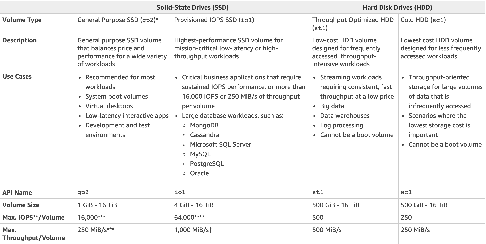

# EBS

## ¿Qué es EBS?

Amazon Elastic Block Storage (`EBS`) provee almacenamiento de volumenes por bloques para ser usado con instancias de Amazon EC2 en la nube de AWS.

Cada volumnes de EBS es replicada autimáticamente dentro de su zona de disponibilidad para protegerse de una falla de componentes, ofreciendo alta disponibilidad y durabilidad.

## Tipos de almacenamiento EBS

- De proposito general(SSD).
- Provisioned IOPS(SSD).
- HDD de rendimiento optimizado (Throughput Optimised HDD).
- Cold HDD
- Magnético

### Caso de uso.

#### SSD

- Proposito General: Mayoria carga de trabajo
- Provisioned IOPS: Bases de datos

#### HDD

- Throughput Optimised: Big Data & Data Warehouses
- Cold HDD: File Servers
- EBS Magnetics: Cargas de trabajo donde los datos que no son accesados frecuentemente

### API Names

- De proposito general(SSD) -> `gp2`
- Provisioned IOPS(SSD) -> `io1`
- HDD de rendimiento optimizado (Throughput Optimised HDD) -> `st1`
- Cold HDD -> `sc1`
- Magnético -> `Standard`

### Más carácteristicas

- Los vólumenes existen en EBS (EBS es como un disco duro virtual).
- Snapshots existen en S3 (Fotografía del disco).
- Snapshots son una copia del disco en un momento específico en el tiempo.
- Snapshots son incrementales, significa que los bloques que van cambiando desde el último snapshot son movidos a S3.
- Para crear un snapshot de un volúmen EBS que sirve como root, debe detener la instancia antes de ralizar el snapshot para garantizar la consistencia.
- Igualmente se puede realizar un snapshot mientras la instancia esta funcionando.
- Se puede crear AMI desde volúmenes como de Snapshots.
- Se puede cambiar el tamaño del volúmen EBS `on the fly`, incluye tamaño y tipo de almacenamiento.
- Los Volúmenes siempre estarán en la misma zona de disponibilidad de la instancia de EC2.

### Migraciones

- Para mover un volumen de EC2 de una AZ a otra, se debe hacer un snapshot del mismo, crear un AMI del snapshot y luego usarlo para crear una nueva instancia en una nueva AZ.
- Para mover un volumen de EC2 a otra región, se debe hacer un snapshot del mismo, crear un AMI del snapshot y copiarlo de una región a otra, luego usar esa AMI para crear una nueva instancia de EC2 en una nueva región.

### Tipos de AMIs

AMI (Amazon Image) pueden ser selccionadas basadas en:

- Región (Regiones y Zonas de disponibilidad).
- Sistema Operativo
- Arquitectura (32-bit o 64-bit)
- Permisos de lanzamientos (Launch Permissions)
- Almacenamiento para el dispositivo root (`Root Device Volume`)
  - Instance Store (Almacenamiento efímero)
  - EBS backed volumes

Todas las AMIs estan categorizadas como backed by Amazon EBS o backed by Instance Store

Para los Volumenes EBS: El dispositivo root de una instancia desplegada desde AMI es un volumen EBS de amazon creada a partir de un snapshot de un Amazon EBS.

Para un **I**nstance **S**tore **V**olumes: El dispositivo root de una instancia desplegada desde una AMI es un **ISV** creada a partir de una plantilla almacenada en S3.

### EBS vs. Instance Store Volumes

- Los **I**nstance **S**tore **V**olumes son almacenamientos efímeros
- Los **ISV** no pueden ser detenidos y si su host falla, la data almacenada se pierde.
- EBS pueden ser detenidos y la data no se pierde si la instancia es detenida.
- Puede ser reiniciada y los datos no se pierden.
- Por defecto, ambos Root volumes puede ser borrados en `termination`. Sin embargo, con volúmenes EBS, se le puede indicar a AWS que mantenga el root device volume.

### Cifrado

- Los snapshots de volumenes cifrados son cifrados automaticamente.
- Volumenes restaurados desde snapshots crifrados tambien son cifrados automaticamente.
- Se pueden compartir snapshots, pero solo si no estan cifrados, inclusive entre cuentas de AWS o hacerse públicos.
- Se puede cifar el volumen root durante la creación de una instancia EC2.

#### Proceso para cifrar un Root Device Volume

- Crear un snapshot no cifrado del Root devive volume
- Crear una copia del este snapshot y cifrarlo.
- Crear un AMI a partir del snapshot cifrado.
- Usar dicho AMI para desplegar una instancia Cifrada.
