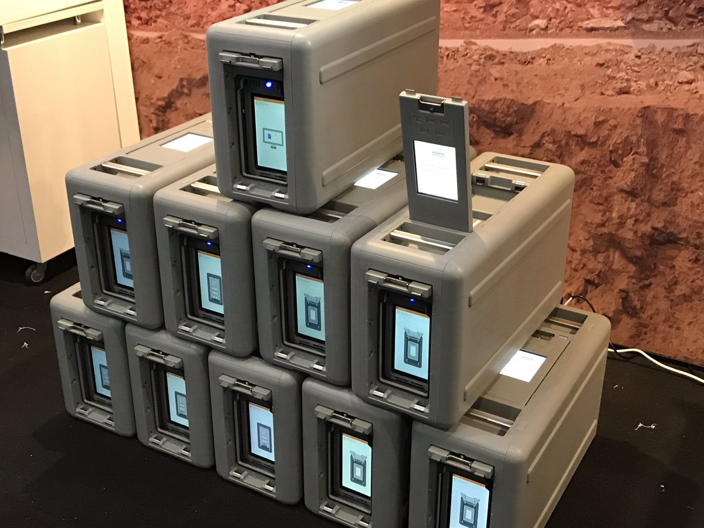

# S3

## ¿Qué es S3?

S3 (Simple Storage Service) es un servicio de almacenamientos de archivos en internet, basado en Objetos.

## Carácteristicas y funcionalidades de S3

- S3 usa un `namespace` universal y debe ser único de manera global.
- La url tiene formato `https://<global-unique-name>.<aws-region>.amazonaws.com/` o `https://<global-unique-name>.s3.amazonaws.com/`
- Cuando cargas un archivo a S3, obtienes un status HTTP 200 si la carga fue exitosa.
- Almacenamiento casí infinito.
- Los archivos pueden ser de 0 bytes hasta 5TB.
- Los archivos son almacenados en `buckets` que son una especie de directorios
- Disponibilidad de almacenamiento por niveles.
- Gestión del ciclo de vida.
- Versionamiento.
- Cifrado.
- Soporte de MFA para la eliminación de archivos
- Listas de control de acceso y políticas en `Buckets`.

## Composión de un objeto de S3

- `Key` Nombre del objeto.
- `Value` Datos del objeto, secuencia de bytes.
- `Version Id` Información para el versionamiento.
- `Metadata` Datos sobre los datos que se estan almacenando.
- `Subresources`
  - Listas de control de acceso.
  - Torrent

## Data consistency en S3

- Consistencia de lectura despues de escritura para `PUTS` de nuevos objetos. (Si cargas un archivo se puede leer inmediatamente despues de cargado).
- Consistencia eventual para sobre escritura `PUTS`y eliminación de objetos `DELETE` (Toma tiempo en propagar los cambios, al momento de la lectura es posible tener acceso a la versión anterior).

## Garantías de S3 ofrecidas por Amazon

- La plataforma de S3 esta diseñada para entrgar un **99.99%** de disponibilidad.
- Amazon garantiza un **99.9%** de disponibilidad.
- Amazon garantiza un **99.999999999%** (11x9) de duración de la información de S3.

## Tipos de almacenamiento

### S3 Standard

Disponibilidad de **99.99%** y Durabilidad de **99.999999999%**, alamacenados redundantemente en distintos a tráves de distintas instalaciones y diseñado para soportar la caida de 2 instalaciones concurrentemente.

### S3 IA (Infrequently Accessed)

Para datos que son accesados de manera poco frecuente pero require acceso rápido cuando es necesitado.

Los cargos son menores que los de `S3 Standard` pero tiene un cargo extra por acceso a los datos.

### S3 One Zone - IA

Cuando se desea una opción de bajo costo para datos de acceso poco frecuente pero no requiere resilencia en multiples zonas de disponibilidad.

#### Availability of S3 – OneZone-IA

**99.50%**

### S3 Intelligent Tiering

Diseñado para optimizar costos automatizando el movimiento de los datos al `tier` con mejor relación costo-efectividad sin impactar en el `performance` o el sobreexigimiento operacional.

### S3 Glacier

Es una opción segura, durable y de bajo costo para almacenar datos.

Puedes almacenar con confianza cualquier cantidad de datos a un costo muy competitivo y superando a soluciones `on-premise`.

Los tiempos de recuperación pueden ser configurables entre minutos y horas.

### S3 Glacier Deep Archive

Es la opción más económica para almacenar datos en S3, los tiempos de recuperación son de 12 horas.

## Vías por las cuales S3 genera cobros

- Almacenamiento.
- Peticiones.
- Gestión de almacenamiento.
- Transferencia de datos.
- Aceleración de transferencia.
- Replicación entre regiones.

## Modo de cobro en los niveles de almacenamiento

### S3 Standard

| Almacenamiento                                     | Precio          |
| -------------------------------------------------- | --------------- |
| Primeros 50 TB / Mes                               | \$0.023 por GB  |
| Siguientes 450 TB / Mes                            | \$0.022 por GB  |
| Sobre 500 TB / Mes                                 | \$0.021 por GB  |
| Acceso no frecuente - Todo el almacenamiento / Mes | \$0.0125 por GB |

### S3 Inteligent Tiering

| Almacenamiento                                            | Precio                         |
| --------------------------------------------------------- | ------------------------------ |
| Acceso frecuente - Primeros 50 TB / Mes                   | \$0.023 por GB                 |
| Acceso frecuente - Siguientes 450 TB / Mes                | \$0.022 por GB                 |
| Acceso frecuente - Sobre 500 TB / Mes                     | \$0.021 por GB                 |
| Acceso no frecuente - Todo el almacenamiento / Mes        | \$0.0125 por GB                |
| Monitoreo y automatización - Todo el almacenamiento / Mes | \$0.0025 por cada 1000 objetos |

### S3 One Zone - acceso no frecuente

| Almacenamiento               | Precio        |
| ---------------------------- | ------------- |
| Todo el almacenamiento / Mes | \$0.01 por GB |

### S3 Glacier

| Almacenamiento               | Precio         |
| ---------------------------- | -------------- |
| Todo el almacenamiento / Mes | \$0.004 por GB |

### S3 Glacier Deep Archive

| Almacenamiento               | Precio           |
| ---------------------------- | ---------------- |
| Todo el almacenamiento / Mes | \$0.00099 por GB |

## Cifrado

Por defecto los `buckets` recién creados son privados, además puedes configurar el control de acceso a través de Políticas de Buckets (`Bucket policies`) y de listas de control de acceso (`Access Control List`).

Los buckets de S3 pueden configurarse para crear `logs` de accesos los cuales registran cualquier petición hecha al bucket, esto puede ser enviado a otro bucket inclusive a otro bucket en otra cuenta.

### Cifrado en tránsito.

El cifrado en tránsito se realiza cuando la comunicación entre el cliente y el servidor esta bajo el protocolo `HTTPS`, ya que el mismo cifra el contenido de las peticiones y si estas son interceptadas no pueden descifradas.

### Cifrado del lado del servidor (Encryption at rest)

`Encryption at rest` es el cifrado que se realiza sobre los datos al momento de guardarlos, puede ser realizada desde el cliente o desde el servidor.

Desde el cliente se cifra el objeto y se lo envia a S3.

Desde el servidor, AWS gestiona las llaves de cifrado y puede ser obtenido de las siguientes maneras:

- S3 Managed Keys - SSE-S3 (`Server Side Encryption S3`) (Gestión de llaves por parte de aws).
- AWS Key Management Service - SSE-KMS (`Server Side Encryption Key Management Service`) (Gestión compartida en entre el usuario y AWS en el manejo de las llaves).
- Server Side Encryption With Customer Provided Keys - SSE-C (El usuario le provee a AWS las llaves para el cifrado de los objetos en S3).

## Versionamiento de los objetos de S3

- Almacena todas las versiones de un objeto, incluido todas las escrituras hasta las eliminaciones.
- Gran herramienta de respaldo.
- Una vez activado, el versionamiento no puede ser deshabilitado, solo suspendido.
- Integra reglas para el ciclo de vida.
- El versionamiento incluye la funcionalidad de `MFA DELETE`, donde se usa el multi-factor de autenticación y puede ser provisto como otra capa de seguridad.

## Gestión del ciclo de vida en S3

- Automatiza el movimiento de objetos entre diferentes [`tiers`](#Tipos-de-almacenamiento) de almacenamientos.
- Puede ser usado en combinación con el versionamiento.
- Puede ser aplicados a versiones actuales y previas.

## Bloqueo de objeto S3 y Bloqueo de Glacier Vault

- El Bloqueo de objeto de S3 (`S3 Object Lock`) es una funcionalidad que permite usar un objeto de s3 bajo el modelo WORM (`Write Once, Read Many`). Ayuda a prevenir que un objeto sea borrado o modificado por un tiempo definido.
- Se puede usar `S3 Object Lock` para cumplir con regulaciones que requieran la modalidad WORM de almacenamiento o para agregar otra capa de protección para evitar cambios en los objetos o que sean eliminados.
- Se puede aplicar a un objeto o al bucket entero.

### Modos de S3 Object Lock

- **Governance Mode**: Los usuarios no pueden sobreescribir o borrar versiones de objetos o alterar la configuración del bloqueo, a menos que tengan permisos especiales.
- **Compliance Mode**: Una versión protegida no puede ser sobre escrita o eliminada por ningun usuario, incluyendo el usario root de la cuenta de aws. Cuando un objeto ha sido bloquedo en este modo, el modo de retención no puede ser cambiado y el periodo de retención no puede ser acortado. Este modo (Compliance) asegura que una version no pueda ser sobreescrita o eliminada durante la duración de su retención. (Un período de retención protege la versión de un objeto durante un tiempo fijo a menos que haya una retención legal en la version del objeto).

Una retención legal previene que una version sea sobre escrita o eliminada, sin embargo una retención legal (`Legal Hold`) no esta asociada a un periodo de retención y se mantiene en efecto hasta que sea removido. Cualquier usuario que posea el permiso `s3:PutObjetLegalHold` puede poner y remover retenciones legales.

### S3 Glacier Vault Lock

Permite un facil despliegue y forza el cumplimiento de controles de S3 Glacier vaults de manera individual bajo un politica de bloqueo de boveda.

Es posible especificar controles, tales como WORM en una politica de Vault Lock y bloquear dicha politica para evitar ediciones en el futuro, una vez la politiá ha sido bloqueada, esta no puede ser cambiada.

## S3 Performance

### Prefijo de S3 (S3 prefix)

Ejemplo: `nombre-del-bucket/directorio-1/subdirectorio-1/archivo.ext`
El prefijo es `/directorio-1/subdirectorio-1`

Ejemplo: `nombre-del-bucket/directorio-2/subdirectorio-1/archivo.ext`
El prefijo es `/directorio-2/subdirectorio-1`

Ejemplo: `nombre-del-bucket/directorio-3/archivo.ext`
El prefijo es `/directorio-3`

| Tipo de petición     | Cantidad de peticiones por prefijo |
| -------------------- | ---------------------------------- |
| PUT/COPY/DELETE/POST | 3500                               |
| GET/HEAD             | 5500                               |

Se puede obtener mejor desempeño distribuyendo las lecturas a traves de diferentes prefijos, por ejemplo dos prefijos pueden alcanzar 11000 peticiones por segundo, si se usan 4 prefijos se pueden alcanzar 22000 peticiones por segundo.

### Limitaciones de S3 cuando se usa KMS (Key Management System)

- Si se estan usando SSE-KMS para cifrar los objetos de S3, hay que tener en cuenta los limites de KMS.
- Cargar y descargar contarán en la couta del KMS
- No se puede solicitar incremento en la cuota del KMS
- Es específico por región y se pueden objener 5500 / 10000 o 30000 peticiones por segundo

### Cargas (Uploads)

- Se recomienda a partir de archivos sobre 100MB.
- Obligatorio para archivos sobre los 5 GB.
- Paralelizar cargas incrementa la eficiencia.

### Descargas (Downloads)

- Paralelizar la descargas en rangos de bytes (S3 Byte-Range fetches)
- Si existe una falla en la descarga, sera específica de un rango de bytes,

## S3 Select

S3 Select habilita a las aplicaciones a obtener solo un subconjunto de datos de un objeto usando expresiones SQL, con ello solo se obtiene los datos necesarios para la aplicación, alcanzando incrementos drasticos de performance en muchos casos, hasta un 400% de mejoras.

Ejemplo: Caso típico donde se tienen almacenados archivos zip que contienen archivos csv, sin `S3 Select` se necesita descargar, descromprimir y procesar el archivo CSV entero para poder obtener los datos que se necesitan.

### Características básicas

- `S3 Select` se usa solo para obtener **solo subconjutos** de datos usando expresiones SQL
- Se obtiene los datos por **columnas o filas** usando expresiones SQL.
- Hay un **ahorro importante en transferencia de datos** y se incrementa la velocidad.

## S3 Glacier Select

Glacier Select permite ejecutar consultas SQL directo en S3 Glacier tier.

Compañias pertenencientes a industrias altamente reguladas escriben directo en `Glacier Select` ya que cumple con regulaciones como **SEC Rule 17a-4** o **HIPAA**.

Usuarios de S3 tienen politicas del ciclo de vida diseñadas para ahorrar en costos de almacenamiento moviendo sus datos hacia `S3 Glacier cuando no require acceder a sus datos de manera frecuente.

## Acceso a Buckets de S3 entre cuentas

### Vias en la que se pueden compartir `buckets` entre cuentas

- Usando Politicas de Buckets y [IAM](../IAM) (Aplica para el bucket entero), **acceso solo via programación**.
- Usando Listas de control de acceso en Buckets y [IAM](../IAM) (objetos individuales), **acceso solo via programación**.
- Roles IAM entre cuentas, acceso via consola web y programación.

## Replicación entre regiones.

- [El versionamiento](#versionamiento-de-los-objetos-de-s3) debe esta activo en ambos `buckets`, tanto en el origen como en el destino.
- Las regiones deben ser únicas.
- Los archivos en un `bucket` existente no son replicados automáticamente.
- Las siguientes cargas de archivos serán replicadas automáticamente.
- Las marcas de eliminación no son replicadas.
- Eliminar versiones individualmente o eliminaciones de las marcas de borrado no serán replicadas.

## Acelaración de transferencia.

La aceleración de transferencia de S3 es un servicio que utiliza la `Cloudfront Edge Network` para acelerar las cargas hacia S3.

En vez de cargar directamente hacia el `bucket` se utiliza una `URL` distinto para cargar el archivo directo a la `Edge Location` más cercana al usuario y posteriormente hacia el `bucket` de S3.

## SnowBall

Snowball es un servicio transporte de datos en la escala de petabytes que usa dispositivos seguros para transferir grandes volúmenes de datos hacia AWS.

Usar `Snowball` aborda los desafios comunes de transferir grandes cantidades de datos incluidos los altos costos de las redes, tiempos de transferencia y preocupaciones de seguridad.

Transferir datos con `Snowball`es simple, rápido, seguro y puede llegar a costar 1/5 del costo de una conexión de internet de alta velocidad.

### Funcionalidades de Snowball

- Importar a S3.
- Exportar de S3.
- Ejecutar `lambda jobs` dentro del dispositivo.

## AWS Data Sync

- Usada para mover grandes cantidades de datos from on-premises hacia AWS.
- Usa sistemas compatibles con NFS y SMB .
- La replicación puede ser cada hora, diaria o semanal.
- Solo hay que instalar el `DataSync agent` para empezar la sincronización.
- Puede ser usado para replicar EFS a EFS.

## Athena vs Macie

### ¿Que es Athena?

Servicio interactivo de consultas el cual esta habilita analizar y consultar datos localizados en S3 usando SQL estandar.

- Serverless, nada que aprovisionar, se paga por query/TB escaneado.
- No hay necesidad de configurar complejos procesos de Extracción/Transformación/Carga (ETL).
- Trabaja directamente con datos almacenados en s3

### ¿Para que puede ser usado?

- Para consultar log files almacenados en S3.
- Generar reportes de negocios en base a datos almacenados en S3.
- Analizar costos y reportes de uso en AWS.
- Correr consultas en datos de `click-stream`.

### ¿Que es Macie?

Servicio de seguridad que utiliza Machine Learning y Procesamiento de lenguaje natural (NLP) para descubrir, clasificar y proteger datos sensibles almacenados en S3.

#### Carácteristicas de Macie

- Usa inteligencia artificial para reconocer si un objeto de S3 contiene datos sensibles como Información personal identificable (PPI).
- Dashboards, reportes y alertas.
- Trabaja directamente con datos almacenados en S3.
- Puede tambien analizar logs de CloudTrail
- Excelente para PCI-DSS y prevenir robos de identidad.

## Estilos de URL de S3

### Path-style request

`https://s3.Region.amazonaws.com/bucket-name/key-name`

### Virtual Hosted-Style Requests

`https://bucket-name.s3.Region.amazonaws.com/key-name`

### Legacy Global Endpoint

`bucket-name.s3.amazonaws.com`
