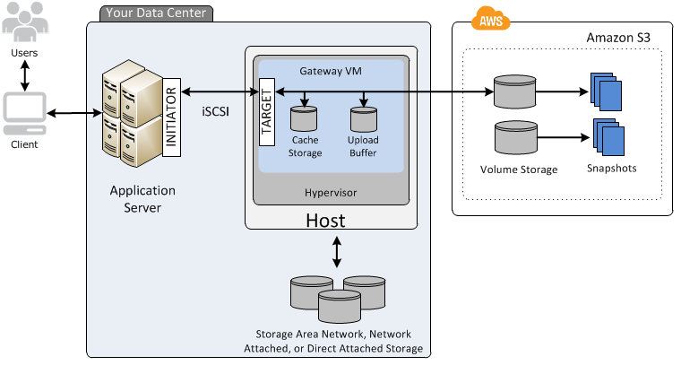

# Storage Gateway

## ¿Qué es Storage Gateway?

Es un servicio que conecta software desplegado `on-premise` con servicio de almacenamiento en la nube para proveer integración segura y sin inconveniente entre infraestructura IT `on-premise` y la infraestructura de almacenamiento de AWS.

El servicio habilita de manera segura el almacenamiento en la nube de AWS de forma escalable y eficiente económicamente.

El Storage Gateway puede ser un dispositivo físico o virtual ubicado en un datacenter que replica de manera transparante los datos en AWS.

Puede ser descargado como una imagen de una maquina virtual que puede ser instalada como host en el datacenter. Storage Gateway soporta `VMware ESXi` o `Microsoft Hyper-V`. Una vez instalado en el `gateway` y asociado a una cuenta de AWS mediante un proceso de activación, se puede usar la cónsola de gestión de AWS para crear la opción de storage gatway más conveniente.

## Tipos de Storage Gateway

* File Gateway (NFS)
* Volume Gateway (iSCSI)
  * Stored Volumes
  * Cached Volumes
* Tape Gateway

### File Gateway

Los archivos son almacenados como objetos en `buckets` de S3 y son accesados a tráves del punto de montura del NFS (`Network File System`). La propeidad, permisos, timestamps y durabilidad es almacenada en S3 en los metadatos del usuario del objeto asociado con el archivo.

Una vez tranferido el objeto a S3, estos pueden ser manejafos como objetos nativos de S3, y las políticas de `bucket` como versionamiento, gestión del ciclo de vida y la replicación entre regiones pueden ser aplicadas directamente en el objeto almacenado en el `bucket`.

### Volume Gateway

Son interfaces de volúmen presente en la aplicación que usan volúmenes de discos bajo el protocolo de bloque iSCSI.

Los datos escritos en esos volúmenes pueden ser respaldados de manera asíncrona como `point-in-time` snapshots de los volúmenes y almacenados en la nube como Amazon EBS Snapshots.

Los snapshots son respaldos incrementales que capturan solo los bloques que presentaron cambios. Todos los snapshots alamcenados también son comprimidos para minimizar los cargos por almacenamiento.

#### Stored Volumes

Stored volumes permiten almacenar tu datos primarios localmente mientras asincronamente son respaldados en AWS. Stored volumes provee a las aplicaciones `on-premise` acceso con baja latencia a los datasets enteros mientras son provistos de respaldos `off-site` duraderos.

Se puede crear volúmenes de almacenamiento y montarlos como dispositivos iSCSI desde los servidores de aplicaciones `on-premise`. Los datos escritos en estos volúmenes son almacenados en el hardware de almacenamiento, estos datos son respaldados de manera asincrona hacia AWS S3 en forma de snapshots de Amazon Elastic Block Store (Amazon EBS).

Los tamaños de los Stored Volumes van de 1GB a 16TB.

#### Cached Volumes

Cached volumes permite usar AWS S3 como almacenamiento de datos primario mientras que es retenida localmente los datos de acceso frecuente en el storage gateway. Los volúmenes Cacheados minimizan la necesidad de scalar la infraestructura de almacenamiento `on-premise` mientras se provee de baja latencia a las aplicaciones que acceden a los datos de acceso frecuente.

Se pueden crear volúmens de hasta 32 TiB de tamaño y adjuntarlos como dispositivos iSCIS desde los servidores de aplicaciones `on-premise`. Los gateway stores de datos se escriben en los volumnes en AWS S3 y conservan las lecturas recientes en el cache de los gateways storage `on-premise` y cargan lo almacenado en el búfer.

Los tamaños de los Cached Volumes van de 1GB a 32TB.

#### Tape Gateway

Tage Gateway ofrece una solución durable y costo-efectiva para archivar los datos en la nube de AWS. La interface de Biblioteca de cintas virtuales (VTL) permite a la existente infraestructura de respaldo basada en Cintas (Tape-based) apalancar el almacenamiento en cintas virtuales que son creadas en el tape gateway.

Cada tape gateway es preconfigurada con un convertidor de medios y contoladores de cintas, los cuales estan disponibles para la apliaciones clientes de respaldo como dispositivos iSCSI.

Se agregan cartuchos de cintas como se necesiten para almacenar los datos. Estan soportados por **Netbackup**, **Backup Exec**, **Veeam**, etc.

